# Picture

|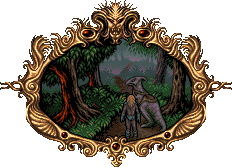
| :---:
|**Valdyn found a riding animal to take him through the eerie forest. Far away, Norka's air-ship was approaching...**

# Themes

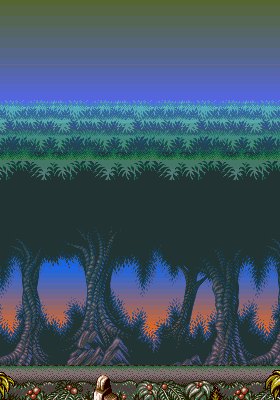

# Stages

[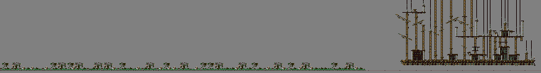](https://raw.githubusercontent.com/b3dgs/lionheart-remake/master/lionheart-game/src/main/resources/com/b3dgs/lionheart/levels/airship/stage11.png)

# Objects

|Object|Name|Description
| :---: | --- | ---
|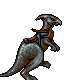 | Animal | Riding animal
| | Talisment | Increases talisment count
|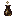 | Potion Little | Restore one health
| | Potion Big | Fill health
| | Life | Increase life count
| | Sword 4 | Set damages value to 4
|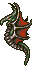 | Dragon 1 | Patrol and fire on delay
| | Dragon 2 | Patrol and fire on delay
| | Dragon 3 | Spawn and move
|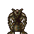 | Gobelin | Throw on delay
|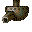 | Canon 1 | Track player and fire on delay
| | Canon 2 | Fire on delay
|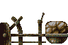 | Catapult | Launch on hit
|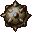 | Spike Bowl | Rotate around
|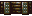 | Platform | Rotate around
|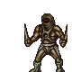 | Guard | Patrol and attack to player
