# Picture

|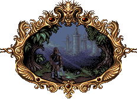
| :---:
|**Valdyn finally emerged from the swamps. In the distance he could see the ancient city on the border of Norka's country.**

# Themes

|Dusk | Dawn | Day
| --- | --- | ---
|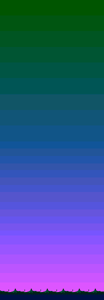] | 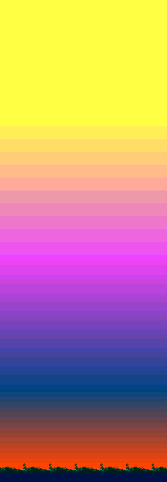] | ]

# Stages

|Stage | Image
| :---: | ---
|1 | [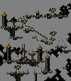](https://raw.githubusercontent.com/b3dgs/lionheart-remake/master/lionheart-game/src/main/resources/com/b3dgs/lionheart/levels/ancienttown/stage6.png)
|1 (hard) | [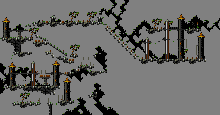](https://raw.githubusercontent.com/b3dgs/lionheart-remake/master/lionheart-game/src/main/resources/com/b3dgs/lionheart/levels/ancienttown/stage6_hard.png)
|2 | [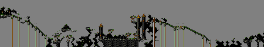](https://raw.githubusercontent.com/b3dgs/lionheart-remake/master/lionheart-game/src/main/resources/com/b3dgs/lionheart/levels/ancienttown/stage7.png)
|2 (hard) | [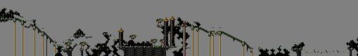](https://raw.githubusercontent.com/b3dgs/lionheart-remake/master/lionheart-game/src/main/resources/com/b3dgs/lionheart/levels/ancienttown/stage7_hard.png)
|3 | 
|3 (hard) | [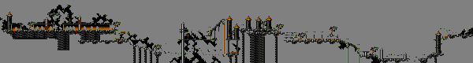](https://raw.githubusercontent.com/b3dgs/lionheart-remake/master/lionheart-game/src/main/resources/com/b3dgs/lionheart/levels/ancienttown/stage8_hard.png)

# Objects

|Object | Name | Description |
| :---: | --- | --- |
| | Talisment | Increases talisment count
| | Potion Little | Restore one health
| | Potion Big | Fill health
| | Life | Increase life count
| | Sword 2 | Set damages value to 2
| | Sword 3 | Set damages value to 3
| | Turning Cube | Patrol on line
|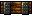 | Floater | Collidable drowning scenery
|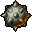 | Spike Bowl | Rotate around
|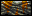 | Platform | Rotate around
| | Bird | Stop vertical movement on hit, or hurt
| | Carnivorous Plant | Kill player on fall
|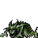 | Crawling | Can walk, turn and jump
|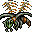 | Bee | Patrol movement or move on player
|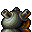 | Canon 1 | Fire on delay
|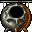 | Canon 2 | Fire on delay
| | Canon 3 | Fire on delay to player
|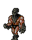 | Executioner | Patrol and attack on sight
|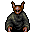 | Gobelin | Throw on delay
