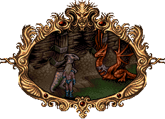
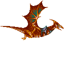
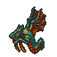
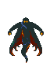
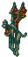

# Picture

|
| :---:
|**Valdyn freed his dragon from the wreck of the destroyed air-ship. Feeling safer, he flew off to Norka's flying citadel.**

# Theme

# Stage

# Objects

|Object | Name | Description
| :---: | --- | ---
| | Dragonfly | Dragonfly
| | Bat | Fly up and down
| | Dragon | Stay on border and fire on delay and then move
| | Wizard | Move on top, attack twice and leave
| | Monkey | Move on top, attack twice and leave
| | Bomb | Explode on proximity