# Picture

|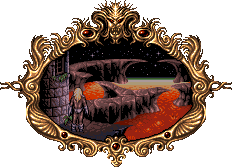
| :---:
|**Valdyn left the city of ancient horrors behind him. Before him lay a wasteland immersed in boiling lava.**

# Themes

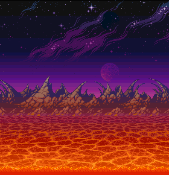

# Stages

|Stage | Image
| --- | ---
|1 | [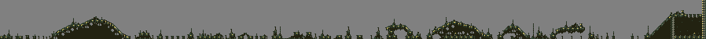](https://raw.githubusercontent.com/b3dgs/lionheart-remake/master/lionheart-game/src/main/resources/com/b3dgs/lionheart/levels/lava/stage9.png)
|1 (hard) | [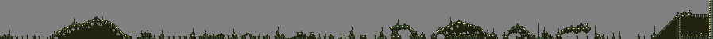](https://raw.githubusercontent.com/b3dgs/lionheart-remake/master/lionheart-game/src/main/resources/com/b3dgs/lionheart/levels/lava/stage9_hard.png)

# Objects

| Object | Name | Description
| :---: | --- | ---
|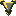 | Talisment | Increases talisment count
|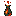 | Potion Little | Restore one health
|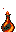 | Potion Big | Fill health
| | Life | Increase life count
|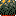 | Melting Platform | Melt on top
|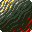 | Floater Cube | Fall and float, move on hit
| | Hot Fireball | Raise on delay
|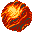 | Fireball Little | Fall and move
|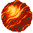 | Fireball Medium | Fall and move
|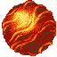 | Fireball Big | Fall and move
|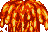 | Geyzer | Raise on delay
