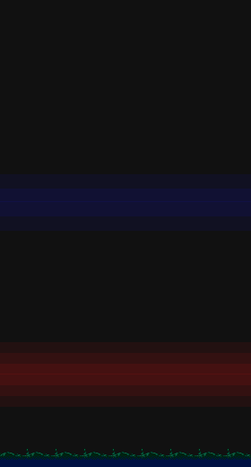
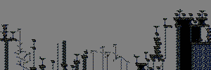
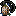
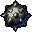
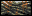
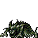
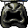

# Theme

# Stage

|Stage | Image
| --- | ---
|1 | 
|1 (hard) | 

# Objects

|Object | Name | Description
| :---: | --- | ---
| | Talisment | Increases talisment count
| | Potion Little | Restore one health
| | Potion Big | Fill health
| | Life | Increase life count
| | Sword 4 | Set damages value to 4
| | Amulet | Unlock alternative end
| | Spike Bowl | Rotate around
| | Platform | Rotate around
| | Bird | Stop vertical movement on hit, or hurt
| | Crawling | Can walk, turn and jump
| | Canon | Fire on delay