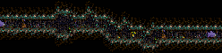
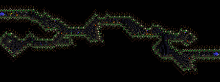
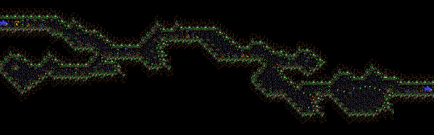
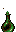
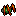

# Stages

|Stage | Image
| --- | ---
|1 | 
|2 | 
|2 (hard) | 

# Objects

|Object | Name | Description
| :---: | --- | ---
| | Talisment | Increases talisment count
| | Potion Little | Restore one health
| | Potion Big | Fill health
| | Life | Increase life count
| | Spider| Patrol or await for player proximity
