# Picture

|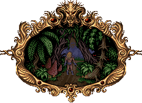
| :---:
|**Nothing could be done. Valdyn would have to make the entire journey on foot. He sighed and entered the swamps.**

# Themes

| Dusk | Dawn | Day
| --- | --- | ---
| 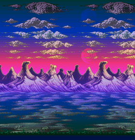 | 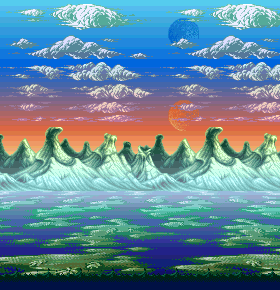 | 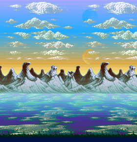

# Stages

|Stage | Image |
| --- | --- |
|1 | [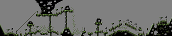](https://raw.githubusercontent.com/b3dgs/lionheart-remake/master/lionheart-game/src/main/resources/com/b3dgs/lionheart/levels/swamp/stage1.png)
|1 (hard) | [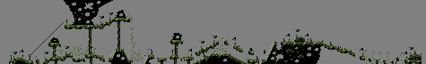](https://raw.githubusercontent.com/b3dgs/lionheart-remake/master/lionheart-game/src/main/resources/com/b3dgs/lionheart/levels/swamp/stage1_hard.png)
|2 | [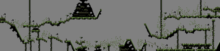](https://raw.githubusercontent.com/b3dgs/lionheart-remake/master/lionheart-game/src/main/resources/com/b3dgs/lionheart/levels/swamp/stage3.png)
|2 (hard) | [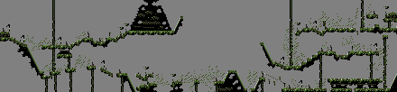](https://raw.githubusercontent.com/b3dgs/lionheart-remake/master/lionheart-game/src/main/resources/com/b3dgs/lionheart/levels/swamp/stage3_hard.png)
|3 | [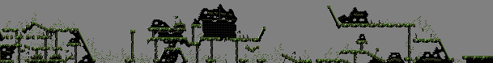](https://raw.githubusercontent.com/b3dgs/lionheart-remake/master/lionheart-game/src/main/resources/com/b3dgs/lionheart/levels/swamp/stage5.png)
|3 (hard) | [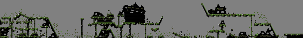](https://raw.githubusercontent.com/b3dgs/lionheart-remake/master/lionheart-game/src/main/resources/com/b3dgs/lionheart/levels/swamp/stage5_hard.png)

# Objects

|Object | Name | Description |
| :---: | --- | --- |
| | Talisment | Increases talisment count
|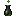 | Potion Little | Restore one health
|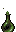 | Potion Big | Fill health
| | Life | Increase life count
|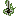 | Sword 2 | Set damages value to 2
|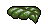 | Sheet | Collidable scenery
|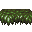 | Turning Auto | Collidable scenery with periodic rotation
|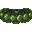 | Turning Hit | Collidable scenery with rotation stopped on hit
|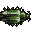 | Beetle | Collidable moving scenery
|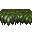 | Floater | Collidable drowning scenery
|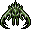 | Bird | Stop vertical movement on hit, or hurt
| | Dragon | Spawn platform on proximity
| | Spike | Raise from ground on delay
|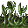 | Carnivorous Plant | Kill player on fall
|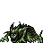 | Crawling | Can walk, turn and jump
|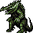 | Dino | Walk on single direction
|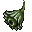 | Flower | Track player and throw projectile on delay
|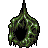 | Nest | Throw projectile tracking player on delay
|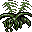 | Bee | Patrol movement or move on player
|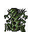 | Grasshopper | Track player and throw projectile on delay
