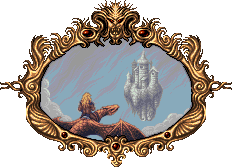
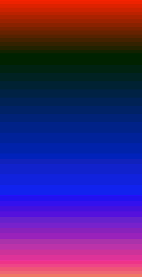
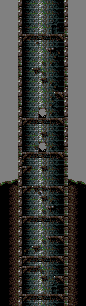
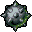
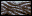
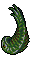

# Picture

|
| :---:
|**Valdyn had penetrated Norka's defenses and now saw the citadel looming before him. At the bottom he saw an entrance...**

# Theme

# Stage

# Objects

|Object | Name | Description
| :---: | --- | ---
| | Potion Little | Restore one health
| | Potion Big | Fill health
| | Spike Bowl | Rotate around
| | Platform | Rotate around
| | Spike | Raise from ground on delay
| | Crawling | Can walk, turn and jump
| | Head| Fire on delay
| | Fish| Jump on delay